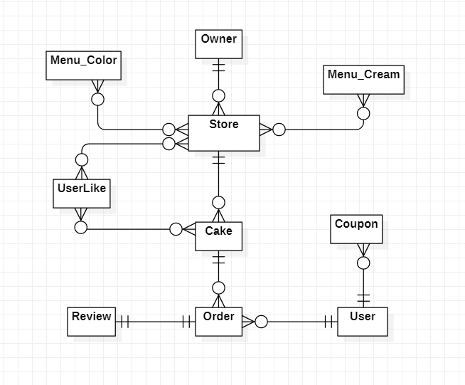

# Allcakes 🍰

### 간단 소개 : 
레터링 케이크의 수요가 증가함에도 불구하고 레터링 케이크 전문 플랫폼이 존재하지 않는다는 사실을 알게 되었습니다. 주문의 불편함과 sns의 이용제약이라는 불편함을 극복하고자 서비스를 개발하게 되었습니다.
<br><br>
### 🌼팀원 :
강현석(BE), 김동윤(BE), 위서영(FE), 함희원(BE)
<br><br>
### 🌷ERD

<br><br>
### 🌻주요기능 :
```
1. 카카오 로그인 기능 (카카오 API)
2. 가게 CRUD
3. 가게별, 케이크별 재료 등록
4. 케이크 CRUD
5. 주문 CRUD
6. 리뷰 CRUD
7. 가게별, 케이크별 필터 및 검색
8. 가게별, 케이크별 찜하기 기능
9. 주문 결제
10. 가게 지도 기능 (카카오 MAP API)
11. 마이페이지
```
<br><br>
### 🌼기술 stack 
**Django / python** <br>
**DB :** postgresql <br>
javascript, ajax, bootstrap.. etc <br>
**배포 :** AWS, ngnix, uwsgi <br>
<br>
<br>
### 🌷회의 기록
: https://www.notion.so/likelionjs/b3b52e690d1f46dfbbf80142030bd127?v=de8599e4ab09443cb51bd955b267dcbd
<br><br>
